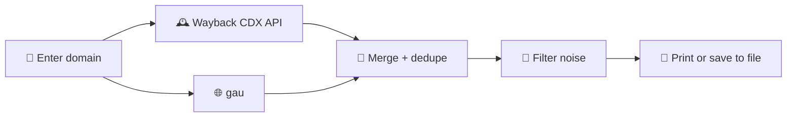

<div align="center">

# 🕸️ urlcollector

**Collect historical URLs for any target domain from the Wayback Machine and `gau`, merged into one clean list.**
A single-file Python helper for bug bounty hunters and pentesters.


<br>

<!-- Replace with a screenshot of the tool -->


[How it works](#-how-it-works) · [Features](#-features) · [Installation](#-installation) · [Usage](#-usage) · [Flags](#-flags) · [Requirements](#-requirements)

</div>

---

## 💡 What is it?

Finding old endpoints, configs and forgotten files means pulling URLs from several archives and cleaning up the mess. **urlcollector** does that in one command.

Give it a target domain. It queries the **Wayback Machine CDX API directly**, merges the results with `gau` (Common Crawl, OTX and more), then deduplicates and filters the list for you.

> 💡 **Why not `waybackurls`?** On larger domains, `waybackurls` can silently drop most of the results because of how it handles CDX pagination. It exits with code `0` and no error, but returns only a tiny fraction of the data. `urlcollector` talks to the CDX API directly and never fails silently.

## ⚙️ How it works



By default it sends a single plain CDX request, with no pagination and no concurrency. That is the same thing a manual `curl` without `&page=` does.

## ✨ Features

| | |
|---|---|
| 🔍 **Direct CDX access** | Talks to the Wayback CDX API with Python's standard library. No `waybackurls` binary needed. |
| 🔀 **Multi-source** | Merges Wayback results with `gau`. Skip `gau` any time with `--no-source`. |
| 🧹 **Noise filtering** | `--nice` and `--strict-nice` strip fonts, images, media and other junk extensions. |
| 🎯 **Extension control** | Exclude extra extensions or keep only the ones you want. |
| 🧬 **Deduplication** | A basic dedup always runs. Add `--uro` for deep normalization. |
| 📑 **Optional pagination** | `--paginate` fetches CDX pages in parallel for domains too big for one request. |
| 🛡️ **No silent failures** | Failed pages are reported with their page numbers. Missing tools stop the run before anything starts. |
| ⚡ **Parallel mode** | Run the CDX fetch and `gau` at the same time with `--parallel`. |
| 📦 **Almost zero dependencies** | One Python file. `gau` is required, `uro` only if you use `--uro`. |

---

## 📥 Installation

From source:

```
$ git clone https://github.com/moh3n355/urlcollector.git
$ cd urlcollector
$ python3 urlcollector.py -h
```

Install the underlying tools:

```
$ go install github.com/lc/gau/v2/cmd/gau@latest
$ pip install uro
```

> 💡 If `go install` fails with a `403` from `proxy.golang.org`, your network may be blocking Go's default module proxy. Retry with:
> ```
> $ GOPROXY=direct GOSUMDB=off go install github.com/lc/gau/v2/cmd/gau@latest
> ```

---

## 🚀 Usage

Basic run:

```
$ python3 urlcollector.py example.com
```

More examples:

```
$ python3 urlcollector.py example.com --paginate --threads 10
$ python3 urlcollector.py example.com --uro
$ python3 urlcollector.py example.com --nice
$ python3 urlcollector.py example.com --strict-nice --exclude-ext .pdf,.zip
$ python3 urlcollector.py example.com --ext-only .js,.json,.php
$ python3 urlcollector.py example.com --no-subs
$ python3 urlcollector.py example.com --only-200
$ python3 urlcollector.py example.com --dates
$ python3 urlcollector.py example.com --no-source
$ python3 urlcollector.py example.com -o urls.txt
$ python3 urlcollector.py example.com --paginate --threads 20 --uro --nice --parallel -o urls.txt
```

Show the help:

```
$ python3 urlcollector.py -h
```

> 💡 **About `--paginate`:** it is only useful when a single request times out on a very large domain. Many parallel requests to archive.org can trigger rate limiting (`503`) or connection resets, so use it only when you need it.

---

## 🚩 Flags

### Fetching

| Flag | Description | Example |
|---|---|---|
| `--paginate` | Fetch CDX page by page with parallel requests instead of one plain request. | `urlcollector.py example.com --paginate` |
| `--threads` | With `--paginate`: parallel workers for CDX pages. Also the thread count passed to `gau` (default: `10`). | `urlcollector.py example.com --paginate --threads 20` |
| `--timeout` | Per-request timeout in seconds for CDX requests (default: `60`). | `urlcollector.py example.com --timeout 120` |
| `--retries` | Retry attempts per CDX request before giving up (default: `3`). | `urlcollector.py example.com --retries 5` |
| `--delay` | Base backoff delay in seconds between retries, doubles each attempt (default: `1.0`). | `urlcollector.py example.com --delay 2` |
| `--no-source` | Skip `gau` and only use the Wayback CDX API. | `urlcollector.py example.com --no-source` |
| `--parallel` | Run the CDX fetch and `gau` concurrently instead of one after the other. | `urlcollector.py example.com --parallel` |

### Scope & filtering

| Flag | Description | Example |
|---|---|---|
| `--no-subs` | Do **not** include subdomains (default: subdomains are included). | `urlcollector.py example.com --no-subs` |
| `--only-200` | Only keep records with HTTP status `200`. | `urlcollector.py example.com --only-200` |
| `--nice` | Strip URLs ending in **hard-noise** extensions (fonts, images, audio, video). | `urlcollector.py example.com --nice` |
| `--strict-nice` | Like `--nice`, but also strips **soft-noise** extensions (`.pdf`, `.txt`, `.xml`, `.zip`, `.doc(x)`, `.ppt(x)`, `.scss`). | `urlcollector.py example.com --strict-nice` |
| `--exclude-ext` | Extra extensions to exclude on top of `--nice` / `--strict-nice`. | `urlcollector.py example.com --exclude-ext .pdf,.zip` |
| `--ext-only` | Keep **only** URLs with these extensions. Overrides all other filtering. | `urlcollector.py example.com --ext-only .js,.json,.php` |
| `--uro` | Deep-normalize and dedupe the final list with `uro`. A basic dedup always runs regardless. | `urlcollector.py example.com --uro` |

### Output

| Flag | Description | Example |
|---|---|---|
| `--dates` | Prefix each CDX URL with its capture timestamp (tab-separated). | `urlcollector.py example.com --dates` |
| `-o`, `--output` | File to write the final results to. When used, the URL list is **only** written to the file, not echoed to the terminal. Progress and warning messages still print, unless `-q`. | `urlcollector.py example.com -o urls.txt` |
| `--print` | Also dump the full URL list to stdout even when `-o` is used. | `urlcollector.py example.com -o urls.txt --print` |
| `-q`, `--quiet` | Suppress all `[*]` / `[!]` messages. Only the final URL list (and the `--output` file) is produced. | `urlcollector.py example.com --uro -q -o urls.txt` |
| `-h`, `--help` | Show help and exit. | `urlcollector.py -h` |

> 💡 `.js` and `.json` are deliberately **never** stripped by `--nice` or `--strict-nice`. They are one of the most common sources of exposed endpoints, secrets and configs. The only way to remove them is explicitly, with `--exclude-ext .js,.json`, or with `--ext-only` naming other extensions.

---

## 🧰 Requirements

`urlcollector` talks to the Wayback CDX API itself using only Python's standard library, so there is no `waybackurls` binary to install. It still wraps `gau` for its Common Crawl and OTX coverage.

| Tool | Needed for |
|---|---|
| [`gau`](https://github.com/lc/gau) | Common Crawl / OTX coverage (not needed with `--no-source`) |
| [`uro`](https://github.com/s0md3v/uro) | Only if you pass `--uro` |

If a required tool is missing, `urlcollector.py` prints the exact install command for it and **exits without running anything**, so partial or incomplete results are never produced.

If some CDX pages fail even after all retries, it says so explicitly on stderr (page numbers included) instead of silently returning an incomplete list.

---

## ⚖️ Responsible use

This tool is for authorized security research and bug bounty work. Only collect and test URLs for targets that are **in scope** for a program you're participating in, or that you have permission to test.

## 📄 License

Released under the MIT License.

<div align="center">
<sub>Built for hunters who read the past before they hit the present. 🕸️</sub>
</div>
